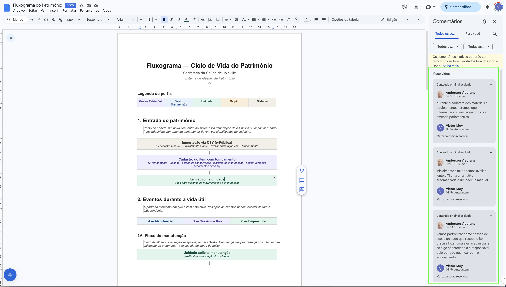
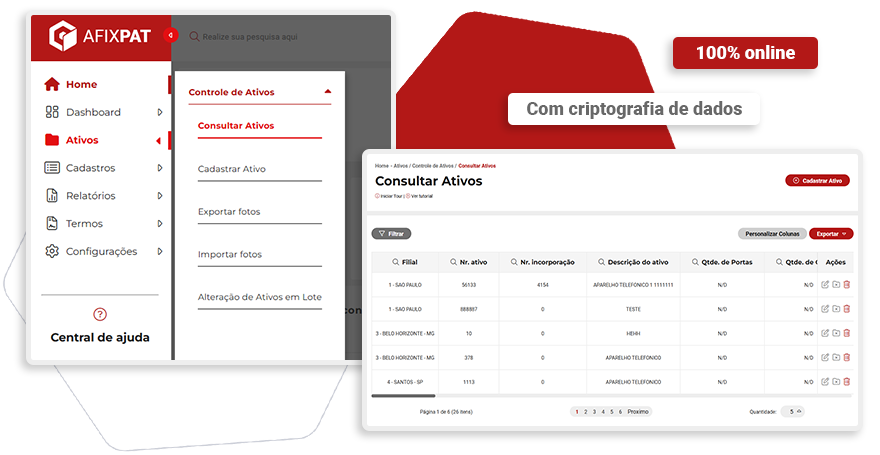
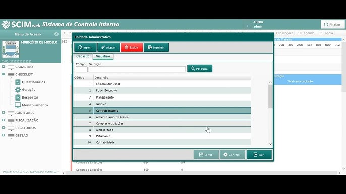
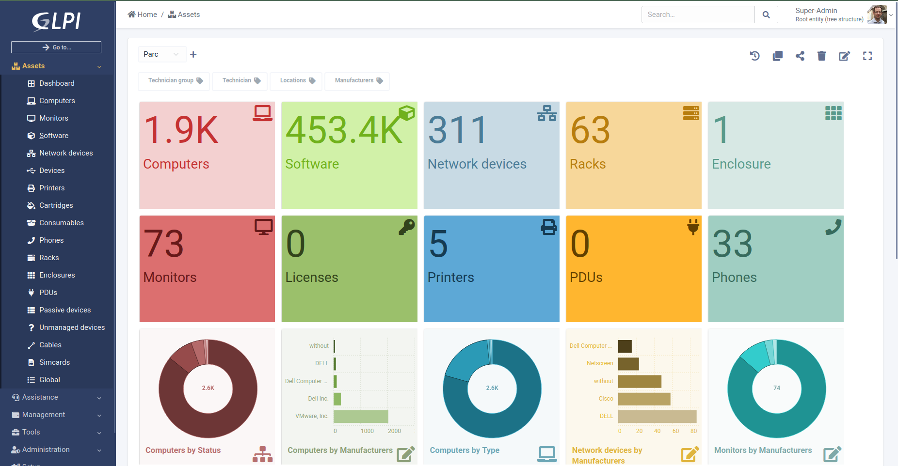
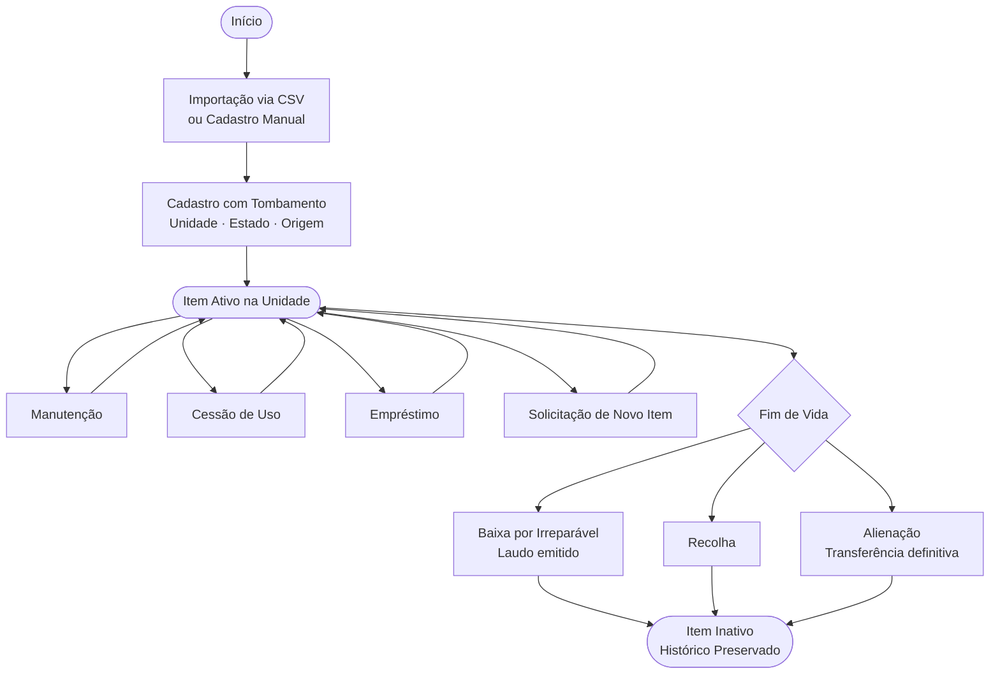
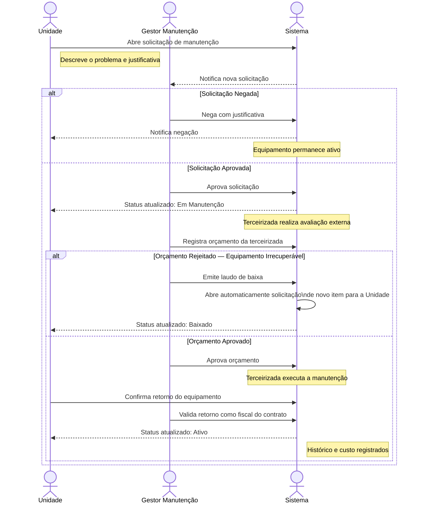
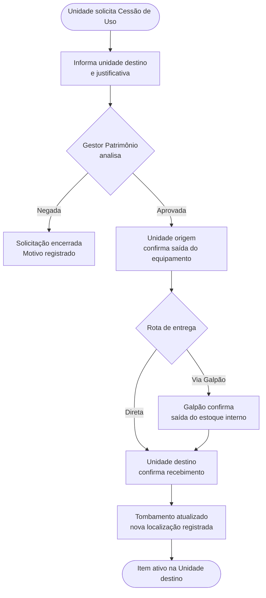
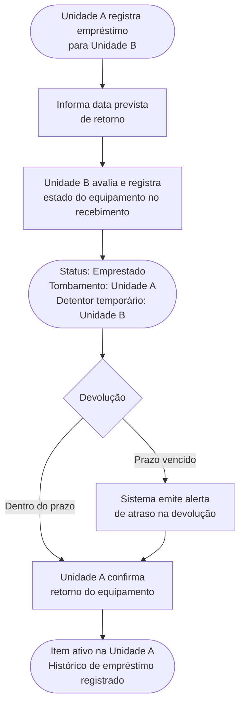
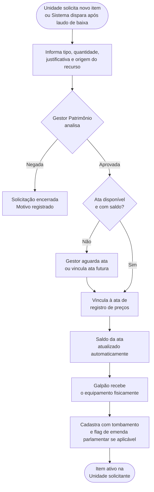
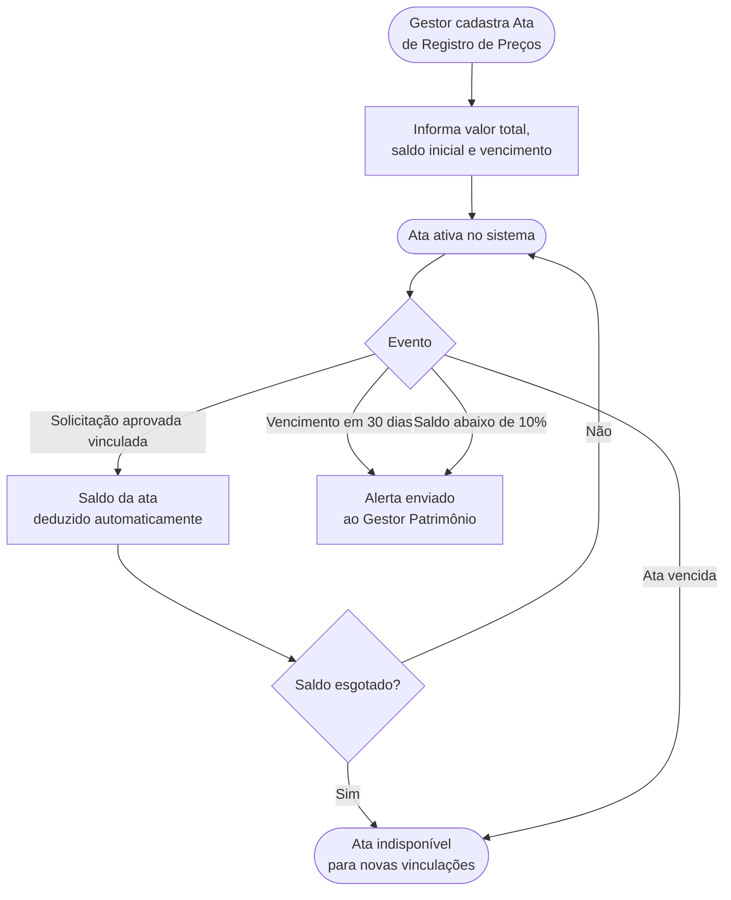

# RFC: Request for Comments — Projeto de Portfólio

**Engenharia de Software — Católica SC**

---

## Identificação

| Campo                            | Valor                           |
| -------------------------------- | ------------------------------- |
| **Título do Projeto**            | Sistema de Gestão de Patrimônio |
| **Linha de Projeto (Direction)** | Web                             |
| **Autor**                        | Victor Moy da Cruz              |
| **Data da Proposta**             | 12/04/2026                      |
| **Versão**                       | 1.0                             |

---

## 1. Visão do Produto e Impacto (O Problema)

### 1.1 Contexto e Problema

A Secretaria Municipal de Saúde de Joinville gerencia um extenso patrimônio físico distribuído por aproximadamente **60 unidades de atendimento** da rede pública — incluindo UBS (Unidades Básicas de Saúde), UME e CAC. Esse patrimônio engloba cerca de **180 autoclaves** e centenas de outros equipamentos médicos e de infraestrutura, cada um identificado individualmente por número de tombamento.

O problema central é a ausência de uma solução integrada de gestão. Atualmente, as informações são mantidas em **planilhas dispersas**, sem padronização nem centralização. A equipe de patrimônio recorre a múltiplos sistemas para operações distintas: o **GLPI** para abertura de chamados de manutenção, o **Branet/DOWS** para recolha de materiais, o **e-Pública** para o cadastro inicial dos itens e o **SEI** para tramitação de documentos. Nenhum desses sistemas "conversa" entre si, e o resultado é uma visão fragmentada e defasada do patrimônio real.

**Consequências práticas da falta de integração:**

- Impossibilidade de visualizar, em tempo real, o estado de conservação de cada equipamento por unidade.
- Ausência de histórico consolidado de manutenção: um equipamento pode ter ido à assistência técnica diversas vezes sem que isso esteja registrado em lugar algum.
- Cessões de equipamentos entre unidades ocorrem de forma verbal, sem registro, gerando perda de rastreabilidade do tombamento.
- Saldo e vencimento das atas de registro de preços, que governam as aquisições, são controlados manualmente e estão sujeitos a erro humano.
- Relatórios gerenciais inexistem: toda análise depende de consolidação manual de múltiplas planilhas, processo lento e propenso a inconsistências.

---

### 1.2 Origem da Demanda e Evidências

O projeto foi solicitado pela **Secretaria Municipal de Saúde de Joinville**, mais especificamente pelo setor de Gestão de Patrimônio. A demanda emergiu de reuniões diretas com o gestor responsável pelo setor, que identificou e relatou as principais dores operacionais do departamento.

Foi realizada **1 entrevista aprofundada** com o gestor do setor de patrimônio da Secretaria. As principais dores identificadas foram:

- Ausência de histórico de manutenção por equipamento, impedindo análise de recorrência e custo.
- Impossibilidade de visualizar saldo e vencimento das atas de registro de preços em tempo real.
- Falta de rastreabilidade nas cessões e movimentações de equipamentos entre unidades.
- Ausência de dashboards e relatórios gerenciais: toda informação é extraída manualmente de planilhas.

Como evidência concreta do engajamento do parceiro, o documento de fluxograma do ciclo de vida do patrimônio (Versão 1) foi encaminhado ao gestor para validação. O gestor retornou com **13 comentários estruturados** sobre o documento, propondo ajustes de nomenclatura, inclusão de novos perfis de usuário e detalhamento de fluxos, o que resultou na elaboração da Versão 2 do fluxograma. Esse processo evidencia interesse real e participação ativa do parceiro na definição do escopo.

---

### 1.3 Análise de Soluções Existentes (Benchmark)

Foram investigadas quatro soluções existentes que atendem, parcialmente, ao mesmo problema de gestão de patrimônio público.

#### AfixPat — Afixcode

- **Link:** https://www.afixcode.com.br/softwares/sistema-de-controle-patrimonial/
- **Público-alvo:** Órgãos públicos e empresas privadas.
- **Funcionalidades principais:** Controle patrimonial contábil com cálculo de depreciação fiscal e societária, movimentações em grupo, transferências, baixas parciais, controle multi-filial e conformidade com o MCASP (Manual de Contabilidade Aplicada ao Setor Público).
- **Limitações:** Foco eminentemente contábil-financeiro. Não contempla fluxo de manutenção com terceirizadas (orçamento, laudo, validação de fiscal de contrato), nem gestão de solicitações por unidades de atendimento, nem dashboards analíticos operacionais.

#### Fiorilli Software — SCPI Patrimônio

- **Link:** https://fiorilli.com.br
- **Público-alvo:** Prefeituras e entidades públicas municipais.
- **Funcionalidades principais:** Gestão de movimentação física e financeira dos bens, depreciação automática, controle de veículos e equipamentos, manutenção preventiva e inventário. Integrado a ERP público completo.
- **Limitações:** Sistema genérico de gestão municipal, sem customização para fluxos específicos de secretaria de saúde. Não oferece controle de atas de registro de preços com saldo e vencimento, nem fluxo de solicitação e aprovação por perfil de unidade de atendimento.

#### GLPI

- **Link:** https://glpi-project.org/pt-br
- **Público-alvo:** Equipes de TI em empresas e órgãos públicos.
- **Funcionalidades principais:** Gestão de ativos de TI, helpdesk, tickets de chamado, histórico de manutenção, contratos e garantias. Open source e amplamente adotado no setor público brasileiro.
- **Limitações:** Concebido para ativos de TI. A própria secretaria já o utiliza para abertura de chamados, mas ele não suporta os fluxos específicos necessários: tombamento físico de equipamentos médicos, cessão de uso entre unidades de saúde, controle de atas de licitação e dashboards analíticos de gestão patrimonial.

#### Prodata Patrimônio

- **Link:** https://prodata.inf.br/portfolio-2/patrimonio/
- **Público-alvo:** Órgãos públicos municipais.
- **Funcionalidades principais:** Gestão desde a aquisição até a baixa do bem, movimentação entre departamentos e inventário físico.
- **Limitações:** Módulo genérico integrado a ERP municipal sem customização para saúde. Sem gestão de manutenção com terceirizadas e validação de orçamento, sem controle de atas e sem dashboards de indicadores operacionais.

#### Comparação entre Soluções

| Solução            | Pontos Fortes                                 | Limitações                                    | Diferencial vs. Projeto                         |
| ------------------ | --------------------------------------------- | --------------------------------------------- | ----------------------------------------------- |
| AfixPat            | Conformidade MCASP; depreciação contábil      | Sem fluxo de manutenção; sem dashboards       | Sem gestão operacional de saúde                 |
| Fiorilli SCPI      | ERP municipal completo; manutenção preventiva | Genérico; sem atas; sem perfis por unidade    | Não atende fluxos específicos de saúde          |
| GLPI               | Open source; tickets; histórico manutenção TI | Focado em TI; sem tombamento físico; sem atas | Já usado pela secretaria, mas insuficiente      |
| Prodata Patrimônio | Gestão do ciclo completo do bem               | Genérico; sem manutenção com terceirizadas    | Sem fluxo de cessão e empréstimo entre unidades |

#### Diferencial do Projeto

Nenhuma das soluções analisadas contempla o conjunto específico de necessidades da Secretaria Municipal de Saúde de Joinville. Em particular, não existe no mercado uma solução que combine:

- Rastreamento individual de equipamentos por tombamento com histórico completo de manutenção (incluindo etapas de orçamento, validação de fiscal de contrato e laudo de baixa);
- Fluxo de cessão de uso e empréstimo temporário entre unidades de saúde, com rastreabilidade do tombamento;
- Controle de saldo e vencimento de atas de registro de preços vinculado à solicitação de novos itens;
- Dashboards analíticos com indicadores operacionais específicos para gestão de patrimônio médico-hospitalar.

Adicionalmente, a secretaria já opera múltiplos sistemas com contratos vigentes, o que inviabiliza a substituição por soluções genéricas. O novo sistema atua como **camada de centralização e inteligência** sobre os dados que hoje são inseridos manualmente nessas ferramentas.

---

### 1.4 Público-Alvo

O sistema será utilizado por **cinco perfis distintos** de usuários, com níveis de acesso e responsabilidades diferenciados:

- **Gestor de Patrimônio:** Profissional da Secretaria responsável pela visão geral do inventário. Aprova ou nega solicitações de cessão de uso e de novos itens, vincula aprovações às atas de registro de preços e acessa todos os dashboards. Conhecimento técnico de sistemas: médio-alto.

- **Gestor de Manutenção:** Fiscal do contrato com as empresas terceirizadas de manutenção. Aprova solicitações de manutenção, valida orçamentos retornados pela terceirizada, acompanha o ciclo completo e emite laudos de baixa quando o equipamento é irrecuperável. Conhecimento técnico: médio.

- **Unidade de Atendimento:** Servidores das UBS, UME, CAC e demais unidades da rede. Realizam solicitações de manutenção, de cessão de uso, de empréstimo e de novos itens, além de consultar e validar o próprio inventário. Nível técnico variável; a interface deve ser simples e intuitiva.

- **Galpão:** Equipe responsável pela entrada e saída física de equipamentos no espaço de armazenamento central. Confirma recebimentos, despachos e realiza o cadastro inicial do tombamento após chegada de novos itens. Conhecimento técnico: básico.

- **Sistema (automático):** Perfil não humano que executa ações automáticas sem intervenção manual. Exemplo: abertura automática de solicitação de novo item após a emissão de um laudo de baixa por impossibilidade de manutenção.

---

### 1.5 Objetivos do Projeto

#### Objetivo Geral

Desenvolver um sistema web de gestão de patrimônio físico para a Secretaria Municipal de Saúde de Joinville, centralizando o ciclo de vida dos equipamentos (do cadastro à baixa) e oferecendo dashboards analíticos para suporte à decisão gerencial, eliminando a dependência de planilhas manuais e dispersas.

#### Objetivos Específicos

1. Implementar o cadastro individual de equipamentos por número de tombamento, com importação via CSV do sistema e-Pública e identificação de itens adquiridos por emenda parlamentar.
2. Desenvolver o módulo de manutenção com fluxo completo: solicitação pela unidade, aprovação pelo Gestor Manutenção, programação com terceirizada, validação de orçamento, execução ou emissão de laudo de baixa, e retorno com validação dupla.
3. Implementar os módulos de cessão de uso e empréstimo entre unidades, com rastreabilidade de tombamento e registro do estado do equipamento pelo receptor.
4. Desenvolver o módulo de controle de atas de registro de preços, com gestão de saldo disponível e vencimento, vinculado ao fluxo de aprovação de novos itens.
5. Criar dashboards analíticos com indicadores operacionais: patrimônio por unidade, itens em manutenção, tempo médio de manutenção, histórico de custos semestrais e unidades que mais solicitam.

---

### 1.6 Métricas de Sucesso (KPIs)

O projeto será considerado bem-sucedido quando os seguintes critérios forem atendidos:

- **Cobertura do inventário:** 100% dos equipamentos da rede cadastrados com tombamento individual no sistema, importados via CSV ou cadastro manual inicial.
- **Rastreabilidade:** Histórico de manutenção disponível para cada equipamento desde a entrada no sistema, com registros de custo e tempo de cada ocorrência.
- **Velocidade de consulta:** Localização de um equipamento específico em menos de 30 segundos, em comparação ao processo manual atual de busca em múltiplas planilhas.
- **Dashboards ativos:** Pelo menos 5 indicadores operacionais disponíveis e atualizados em tempo real na tela inicial do gestor.
- **Adoção:** Pelo menos 3 perfis de usuário (Gestor Patrimônio, Unidade de Atendimento e Galpão) ativos e utilizando o sistema nos primeiros 60 dias após a implantação.

## 2. Engenharia de Requisitos

### 2.1 Personas

O sistema possui cinco perfis de usuário. Quatro deles são humanos e estão representados por personas abaixo. O quinto, **Sistema**, é um ator automatizado que executa ações no sistema em resposta a eventos (como abrir uma solicitação de novo item após um laudo de baixa). Por esse motivo, não possui persona, mas seus comportamentos estão cobertos nos requisitos funcionais.

---

#### Persona 1 — Samuel, Gestor de Patrimônio

> _"Eu preciso saber agora mesmo o que cada unidade tem, em que estado está e onde foi parar aquela autoclave que sumiu."_

**Contexto:** Samuel tem 38 anos e trabalha há 6 anos no setor de gestão de patrimônio da Secretaria Municipal de Saúde de Joinville. É responsável por supervisionar o inventário de aproximadamente 60 unidades de atendimento da rede. Seu dia a dia envolve responder a solicitações das unidades, aprovar movimentações de equipamentos e prestar contas a superiores sobre o estado do patrimônio público.

**Objetivos:**

- Ter visibilidade centralizada de todo o patrimônio da rede em tempo real.
- Aprovar ou negar solicitações de cessão de uso e de novos itens com agilidade.
- Gerar relatórios gerenciais sem depender de planilhas manuais.
- Controlar o saldo e vencimento das atas de registro de preços.

**Principais dificuldades:**

- Hoje precisa consultar múltiplos sistemas e planilhas para responder perguntas simples como "quantas autoclaves estão em manutenção?"
- Cessões de equipamentos acontecem verbalmente entre unidades sem qualquer registro.
- Não consegue identificar padrões de problema em equipamentos específicos por falta de histórico.

---

#### Persona 2 — Carla, Gestora de Manutenção

> _"Quando autorizo uma manutenção, preciso ter certeza de que o equipamento vai voltar e de que o serviço foi feito de verdade."_

**Contexto:** Carla tem 42 anos e é fiscal de contratos de manutenção da Secretaria de Saúde. É responsável por gerenciar o relacionamento com as empresas terceirizadas que prestam serviços de manutenção nos equipamentos da rede. Como fiscal de contrato, tem responsabilidade jurídica de atestar que os serviços foram executados conforme contratado.

**Objetivos:**

- Acompanhar o ciclo completo de manutenção de cada equipamento, da solicitação ao retorno.
- Validar orçamentos das terceirizadas antes de autorizar a execução.
- Ter histórico consolidado de quantas manutenções cada equipamento teve e quanto custou.
- Emitir laudos de baixa quando um equipamento é declarado irrecuperável.

**Principais dificuldades:**

- Não existe hoje nenhum sistema que registre o histórico de manutenção por equipamento.
- Precisa controlar manualmente em planilhas o status de cada equipamento que está com terceirizadas.
- Quando um equipamento some ou demora a retornar, não há forma de rastrear onde está.

---

#### Persona 3 — Rodrigo, Coordenador de UBS

> _"Quando preciso de um equipamento ou ele quebra, nunca sei quanto tempo vai demorar nem o que está acontecendo com o meu pedido."_

**Contexto:** Rodrigo tem 35 anos e é coordenador de uma Unidade Básica de Saúde (UBS) de médio porte em Joinville. Lida diariamente com a operação da unidade e é o responsável por acionar a secretaria quando há necessidade de manutenção, novos equipamentos ou cessão de itens. Tem conhecimento técnico básico de sistemas.

**Objetivos:**

- Solicitar manutenção, novos itens e cessões de forma simples e rastreável.
- Acompanhar o status das suas solicitações sem precisar ligar para a secretaria.
- Consultar o inventário da sua unidade rapidamente.
- Registrar empréstimos de equipamentos para outras unidades de forma oficial.

**Principais dificuldades:**

- Hoje abre chamados no GLPI mas não consegue acompanhar o que acontece depois.
- Não sabe quais equipamentos constam oficialmente no inventário da sua unidade.
- Empréstimos entre unidades são feitos verbalmente, sem nenhum registro ou responsabilização.

---

#### Persona 4 — Felipe, Operador do Galpão

> _"Chegou equipamento novo, preciso dar entrada logo e deixar tudo registrado direitinho antes de mandar pra unidade."_

**Contexto:** Felipe tem 29 anos e faz parte da equipe do galpão central da Secretaria de Saúde. É responsável pelo recebimento físico de equipamentos novos, pela conferência de itens que retornam de cessão ou manutenção e pelo despacho de equipamentos para as unidades da rede. Tem conhecimento técnico básico de sistemas e usa o computador principalmente para registros operacionais.

**Objetivos:**

- Registrar a entrada de novos equipamentos com tombamento de forma rápida e sem erros.
- Confirmar saídas e recebimentos de forma rastreável.
- Importar o inventário inicial via CSV sem precisar digitar item por item.
- Ter clareza sobre quais equipamentos estão no galpão aguardando destinação.

**Principais dificuldades:**

- Hoje o controle de entrada e saída do galpão é feito em planilha ou de forma verbal.
- Dois estoques paralelos, o estoque interno do galpão e o Branet (estoque oficial), geram confusão sobre qual é o registro correto.
- Não há como saber facilmente quantos itens aguardam despacho ou para qual unidade cada item foi destinado.

---

### 2.2 Casos de Uso Principais

Os casos de uso abaixo representam os principais fluxos operacionais do sistema, organizados por módulo.

#### Módulo de Patrimônio

- **UC01 — Importar patrimônio via CSV:** O Galpão importa um arquivo CSV exportado do e-Pública para popular o sistema com o inventário inicial.
- **UC02 — Cadastrar item manualmente:** O Galpão cadastra um novo equipamento com número de tombamento, unidade de destino, estado de conservação e flag de emenda parlamentar.
- **UC03 — Consultar inventário da unidade:** A Unidade consulta a lista de equipamentos registrados sob sua responsabilidade.
- **UC04 — Consultar inventário geral:** O Gestor de Patrimônio consulta o inventário completo da rede com filtros por unidade, tipo de equipamento e estado.

#### Módulo de Manutenção

- **UC05 — Solicitar manutenção:** A Unidade abre uma solicitação de manutenção para um equipamento específico, com descrição do problema e justificativa.
- **UC06 — Aprovar ou negar manutenção:** O Gestor de Manutenção analisa a solicitação e aprova ou nega, registrando o motivo.
- **UC07 — Registrar orçamento da terceirizada:** O Gestor de Manutenção registra o orçamento retornado pela empresa terceirizada.
- **UC08 — Validar orçamento:** O Gestor de Manutenção aprova ou rejeita o orçamento. Se rejeitado, emite laudo de baixa e o sistema abre automaticamente uma solicitação de novo item.
- **UC09 — Confirmar retorno do equipamento:** A Unidade e o Gestor de Manutenção confirmam o retorno do equipamento, registrando o estado pós-manutenção.

#### Módulo de Cessão de Uso

- **UC10 — Solicitar cessão de uso:** A Unidade solicita a transferência de um equipamento para outra unidade, com justificativa.
- **UC11 — Aprovar ou negar cessão:** O Gestor de Patrimônio aprova ou nega a solicitação.
- **UC12 — Confirmar saída e recebimento:** A unidade de origem confirma a saída e a unidade de destino confirma o recebimento, atualizando o tombamento.

#### Módulo de Empréstimo

- **UC13 — Registrar empréstimo:** A Unidade A registra um empréstimo para a Unidade B, com data prevista de retorno.
- **UC14 — Avaliar estado do equipamento:** A Unidade B registra o estado do equipamento no recebimento, assumindo responsabilidade.
- **UC15 — Confirmar retorno:** A Unidade A confirma o retorno do equipamento e encerra o empréstimo.

#### Módulo de Novos Itens

- **UC16 — Solicitar novo item:** A Unidade solicita a aquisição de um novo equipamento, informando tipo, quantidade, justificativa e origem do recurso.
- **UC17 — Aprovar solicitação:** O Gestor de Patrimônio aprova e vincula a solicitação a uma ata de registro de preços disponível.
- **UC18 — Registrar entrada no galpão:** O Galpão registra a chegada do equipamento e realiza o cadastro com tombamento.

#### Módulo de Atas

- **UC19 — Cadastrar ata de registro de preços:** O Gestor de Patrimônio cadastra uma ata com valor total, saldo disponível e data de vencimento.
- **UC20 — Consultar saldo de ata:** O Gestor consulta o saldo atualizado e o vencimento das atas ativas.

#### Módulo de Dashboards

- **UC21 — Visualizar dashboard gerencial:** O Gestor de Patrimônio acessa indicadores consolidados da rede: patrimônio por unidade, itens em manutenção, tempo médio de manutenção, custo semestral e unidades que mais solicitam.

---

### 2.3 Requisitos Funcionais (RF)

#### Autenticação e Controle de Acesso

| ID   | Requisito                                                                                                                               |
| ---- | --------------------------------------------------------------------------------------------------------------------------------------- |
| RF01 | O sistema deve permitir que o usuário realize login com e-mail e senha.                                                                 |
| RF02 | O sistema deve permitir que o administrador cadastre usuários e atribua perfis (Gestor Patrimônio, Gestor Manutenção, Unidade, Galpão). |
| RF03 | O sistema deve restringir o acesso a funcionalidades de acordo com o perfil do usuário autenticado.                                     |
| RF04 | O sistema deve manter sessão autenticada com expiração automática por inatividade.                                                      |

#### Gestão de Patrimônio

| ID   | Requisito                                                                                                                                                                                          |
| ---- | -------------------------------------------------------------------------------------------------------------------------------------------------------------------------------------------------- |
| RF05 | O sistema deve permitir que o Galpão importe equipamentos via arquivo CSV no formato exportado pelo e-Pública.                                                                                     |
| RF06 | O sistema deve permitir que o Galpão cadastre um equipamento manualmente, informando: número de tombamento, descrição, unidade de localização, estado de conservação e flag de emenda parlamentar. |
| RF07 | O sistema deve garantir que o número de tombamento seja único e imutável após o cadastro.                                                                                                          |
| RF08 | O sistema deve permitir que a Unidade consulte o inventário dos equipamentos sob sua responsabilidade.                                                                                             |
| RF09 | O sistema deve permitir que o Gestor de Patrimônio consulte o inventário completo da rede, com filtros por unidade, tipo de equipamento, estado de conservação e status.                           |
| RF10 | O sistema deve registrar e exibir o histórico completo de movimentações e eventos de cada equipamento.                                                                                             |

#### Manutenção

| ID   | Requisito                                                                                                                                              |
| ---- | ------------------------------------------------------------------------------------------------------------------------------------------------------ |
| RF11 | O sistema deve permitir que a Unidade abra uma solicitação de manutenção para um equipamento, informando descrição do problema e justificativa.        |
| RF12 | O sistema deve permitir que o Gestor de Manutenção aprove ou negue uma solicitação de manutenção, com registro de justificativa.                       |
| RF13 | O sistema deve alterar o status do equipamento para "em manutenção" após aprovação da solicitação.                                                     |
| RF14 | O sistema deve permitir que o Gestor de Manutenção registre o orçamento retornado pela empresa terceirizada.                                           |
| RF15 | O sistema deve permitir que o Gestor de Manutenção aprove ou rejeite o orçamento registrado.                                                           |
| RF16 | O sistema deve permitir que o Gestor de Manutenção emita um laudo de baixa quando o equipamento for declarado irrecuperável.                           |
| RF17 | O sistema deve abrir automaticamente uma solicitação de novo item ao Gestor de Patrimônio quando um laudo de baixa for emitido.                        |
| RF18 | O sistema deve permitir que a Unidade e o Gestor de Manutenção confirmem o retorno do equipamento após a manutenção, registrando o estado pós-serviço. |
| RF19 | O sistema deve registrar o custo e a data de cada manutenção no histórico do equipamento.                                                              |

#### Cessão de Uso

| ID   | Requisito                                                                                                                                           |
| ---- | --------------------------------------------------------------------------------------------------------------------------------------------------- |
| RF20 | O sistema deve permitir que a Unidade solicite a cessão de uso de um equipamento para outra unidade, informando justificativa e unidade de destino. |
| RF21 | O sistema deve permitir que o Gestor de Patrimônio aprove ou negue uma solicitação de cessão de uso.                                                |
| RF22 | O sistema deve permitir que a unidade de origem confirme a saída do equipamento.                                                                    |
| RF23 | O sistema deve permitir que a unidade de destino confirme o recebimento e atualizar automaticamente a localização do tombamento.                    |

#### Empréstimo

| ID   | Requisito                                                                                                                                      |
| ---- | ---------------------------------------------------------------------------------------------------------------------------------------------- |
| RF24 | O sistema deve permitir que a Unidade A registre um empréstimo de equipamento para a Unidade B, informando data prevista de retorno.           |
| RF25 | O sistema deve manter o tombamento do equipamento vinculado à Unidade A durante o período de empréstimo, sinalizando a localização temporária. |
| RF26 | O sistema deve permitir que a Unidade B registre a avaliação do estado do equipamento no recebimento.                                          |
| RF27 | O sistema deve permitir que a Unidade A confirme o retorno do equipamento, encerrando o empréstimo e atualizando o histórico.                  |

#### Solicitação de Novos Itens

| ID   | Requisito                                                                                                                                                                                                                                          |
| ---- | -------------------------------------------------------------------------------------------------------------------------------------------------------------------------------------------------------------------------------------------------- |
| RF28 | O sistema deve permitir que a Unidade solicite a aquisição de um novo equipamento, informando tipo, quantidade, justificativa e origem do recurso (regular ou emenda parlamentar).                                                                 |
| RF29 | O sistema deve permitir que o Gestor de Patrimônio aprove ou negue a solicitação, vinculando a aprovação a uma ata de registro de preços.                                                                                                          |
| RF30 | O sistema deve permitir que o Galpão registre a entrada física do novo equipamento e realize o cadastro com tombamento.                                                                                                                            |
| RF36 | O sistema deve distinguir dois tipos de estoque no Galpão: **estoque interno** (equipamentos sob guarda física do galpão) e **estoque Branet** (registro oficial de saída). O Galpão deve poder visualizar e atualizar cada estoque separadamente. |
| RF37 | O sistema deve permitir que o Galpão confirme o despacho físico de um equipamento para uma unidade de destino, atualizando o estoque interno.                                                                                                      |

#### Controle de Atas

| ID   | Requisito                                                                                                                                              |
| ---- | ------------------------------------------------------------------------------------------------------------------------------------------------------ |
| RF31 | O sistema deve permitir que o Gestor de Patrimônio cadastre atas de registro de preços, informando valor total, saldo disponível e data de vencimento. |
| RF32 | O sistema deve atualizar automaticamente o saldo da ata a cada aprovação de solicitação vinculada a ela.                                               |
| RF33 | O sistema deve alertar o Gestor de Patrimônio quando uma ata estiver com vencimento em até 30 dias ou com saldo inferior a 10% do valor total.         |

#### Dashboards

| ID   | Requisito                                                                                                                                                                                                                                                                         |
| ---- | --------------------------------------------------------------------------------------------------------------------------------------------------------------------------------------------------------------------------------------------------------------------------------- |
| RF34 | O sistema deve exibir para o Gestor de Patrimônio um dashboard com os seguintes indicadores: quantidade de equipamentos por unidade, quantidade de itens em manutenção, tempo médio de manutenção, histórico de custo semestral e ranking de unidades por volume de solicitações. |
| RF35 | O sistema deve permitir que o usuário filtre os dados dos dashboards por período, unidade e tipo de equipamento.                                                                                                                                                                  |

---

### 2.4 Requisitos Não Funcionais (RNF)

#### Desempenho

| ID    | Requisito                                                                                                    |
| ----- | ------------------------------------------------------------------------------------------------------------ |
| RNF01 | O sistema deve responder a consultas e ações do usuário em no máximo 2 segundos em condições normais de uso. |
| RNF02 | O sistema deve suportar pelo menos 100 usuários simultâneos sem degradação de desempenho.                    |
| RNF03 | A importação de arquivos CSV com até 10.000 linhas deve ser concluída em no máximo 30 segundos.              |

#### Segurança

| ID    | Requisito                                                                                                                                                      |
| ----- | -------------------------------------------------------------------------------------------------------------------------------------------------------------- |
| RNF04 | O sistema deve utilizar autenticação segura com senha criptografada (bcrypt ou equivalente).                                                                   |
| RNF05 | O sistema deve implementar controle de acesso baseado em perfis (RBAC), garantindo que cada usuário acesse apenas as funcionalidades permitidas ao seu perfil. |
| RNF06 | O sistema deve registrar logs de auditoria para todas as ações críticas: aprovações, negações, baixas, cessões e alterações de tombamento.                     |
| RNF07 | O sistema deve utilizar comunicação HTTPS em todas as requisições.                                                                                             |

#### Disponibilidade

| ID    | Requisito                                                                                                           |
| ----- | ------------------------------------------------------------------------------------------------------------------- |
| RNF08 | O sistema deve ter disponibilidade mínima de 99% em dias úteis no horário de funcionamento da secretaria (07h–19h). |

#### Usabilidade

| ID    | Requisito                                                                                                                      |
| ----- | ------------------------------------------------------------------------------------------------------------------------------ |
| RNF09 | O sistema deve ser responsivo e funcionar adequadamente nos navegadores Google Chrome e Microsoft Edge em versões atualizadas. |
| RNF10 | As ações mais frequentes de cada perfil devem ser acessíveis em no máximo 3 cliques a partir da tela inicial.                  |
| RNF11 | O sistema deve exibir mensagens de erro claras e orientadas ao usuário, sem expor detalhes técnicos internos.                  |

#### Escalabilidade

| ID    | Requisito                                                                                                                                                     |
| ----- | ------------------------------------------------------------------------------------------------------------------------------------------------------------- |
| RNF12 | A arquitetura do sistema deve permitir a adição de novas unidades de atendimento sem necessidade de alterações estruturais no banco de dados ou na aplicação. |

---

### 2.5 Regras de Negócio

| ID   | Regra                                                                                                                                                                 |
| ---- | --------------------------------------------------------------------------------------------------------------------------------------------------------------------- |
| RN01 | O número de tombamento é único por equipamento e não pode ser alterado após o cadastro.                                                                               |
| RN02 | Um equipamento com status "em manutenção" não pode ser cedido, emprestado ou baixado até o encerramento do ciclo de manutenção.                                       |
| RN03 | Somente o Gestor de Manutenção pode aprovar solicitações de manutenção, validar orçamentos e emitir laudos de baixa.                                                  |
| RN04 | Somente o Gestor de Patrimônio pode aprovar solicitações de cessão de uso e de novos itens.                                                                           |
| RN05 | O empréstimo entre unidades não requer aprovação do Gestor de Patrimônio, mas deve ser registrado no sistema pela unidade cedente.                                    |
| RN06 | Durante um empréstimo, o tombamento do equipamento permanece vinculado à unidade de origem. A unidade receptora aparece apenas como detentora temporária.             |
| RN07 | A emissão de um laudo de baixa por impossibilidade de manutenção deve gerar automaticamente uma solicitação de novo item no nome da unidade de origem do equipamento. |
| RN08 | Uma ata de registro de preços vencida não pode ser vinculada a novas solicitações de aquisição.                                                                       |
| RN09 | O saldo de uma ata não pode ficar negativo. O sistema deve impedir aprovações que ultrapassem o saldo disponível.                                                     |
| RN10 | Itens adquiridos por emenda parlamentar devem ser sinalizados com flag específica no cadastro, visível em todos os relatórios e históricos.                           |
| RN11 | A confirmação de retorno de manutenção exige validação de dois atores: a Unidade (como usuária do equipamento) e o Gestor de Manutenção (como fiscal do contrato).    |

---

### 2.6 Fora do Escopo

Os itens abaixo foram explicitamente excluídos do escopo deste projeto, seja por limitação de prazo, por dependerem de contratos vigentes ou por pertencerem a outros sistemas ou setores.

- **Integração técnica com sistemas legados:** O sistema não se integrará via API com o GLPI, SEI, e-Pública ou Branet. Toda entrada de dados oriunda desses sistemas será feita manualmente ou via importação CSV.
- **Gestão de insumos e materiais de consumo:** O sistema cobre apenas equipamentos patrimoniais com número de tombamento. Materiais de consumo (medicamentos, insumos hospitalares) são gerenciados por outro setor e não fazem parte deste projeto.
- **Gestão financeira e contábil:** O sistema não realiza cálculo de depreciação contábil, não gera balanço patrimonial e não atende às normas do MCASP. Essas funcionalidades são cobertas pelos sistemas contábeis já existentes na prefeitura.
- **Acesso de empresas terceirizadas:** Empresas de manutenção não terão acesso ao sistema. Todas as interações com terceirizadas são mediadas pelo Gestor de Manutenção.
- **Módulo de licitação e compras:** O sistema não gerencia processos licitatórios. Apenas registra as atas já existentes e controla seu saldo e vencimento.
- **Aplicativo mobile nativo:** O sistema será desenvolvido como aplicação web responsiva, acessível pelo navegador em dispositivos móveis. Não haverá aplicativo nativo para iOS ou Android.
- **Gestão de empenhos:** O sistema não registra nem acompanha empenhos orçamentários. Apenas o vínculo básico entre solicitação e ata de preços está no escopo.
- **Controle de frota de veículos:** Veículos da secretaria não fazem parte do patrimônio atendido por este sistema.

## 3. Fluxos e Comportamento do Sistema

### 3.1 Fluxo Principal do Usuário

#### Visão Geral — Ciclo de Vida do Patrimônio

O diagrama abaixo representa a visão macro do sistema: um equipamento entra pelo cadastro, passa por eventos ao longo da sua vida útil e é encerrado por um dos três tipos de baixa.

---

#### Fluxo de Manutenção

O fluxo de manutenção é o mais complexo do sistema, envolvendo quatro atores: Unidade, Gestor de Manutenção, terceirizada (externa ao sistema) e o próprio Sistema (para ações automáticas).

---

#### Fluxo de Cessão de Uso

Transferência permanente ou temporária de um equipamento entre unidades, com aprovação obrigatória do Gestor de Patrimônio.

---

#### Fluxo de Empréstimo

Cessão temporária entre unidades, sem necessidade de aprovação da secretaria. A unidade receptora assume responsabilidade formal pelo equipamento durante o período.

---

#### Fluxo de Solicitação de Novo Item

Cobre tanto solicitações regulares quanto itens adquiridos via emenda parlamentar. O fluxo é disparado manualmente pela unidade ou automaticamente pelo sistema após um laudo de baixa.

---

#### Fluxo de Controle de Atas

---

### 3.2 Fluxos Alternativos

---

#### FA01 — Manutenção negada pelo Gestor de Manutenção

**Gatilho:** O Gestor de Manutenção analisa a solicitação e considera que a manutenção não é necessária ou não está devidamente justificada.

**Comportamento esperado:**

- O sistema registra a negação com o motivo informado pelo gestor.
- O equipamento permanece com status **ativo** — não há alteração na sua situação.
- A unidade recebe uma notificação com o motivo da negação.
- A solicitação é encerrada e fica disponível no histórico do equipamento.

---

#### FA02 — Orçamento da terceirizada rejeitado - Laudo de Baixa

**Gatilho:** O Gestor de Manutenção avalia que o custo de manutenção é inviável ou que o equipamento é irrecuperável.

**Comportamento esperado:**

- O gestor emite um laudo de baixa, registrando o motivo técnico.
- O equipamento tem seu status alterado para **baixado por impossibilidade de manutenção**.
- O sistema abre **automaticamente** uma nova solicitação de novo item vinculada à unidade de origem do equipamento.
- O Gestor de Patrimônio é notificado sobre a solicitação automática gerada.
- O histórico do equipamento é preservado para auditoria.

---

#### FA03 — Cessão de Uso negada pelo Gestor de Patrimônio

**Gatilho:** O Gestor de Patrimônio analisa a solicitação de cessão e decide que ela não deve ser aprovada.

**Comportamento esperado:**

- O sistema registra a negação com o motivo informado.
- O tombamento do equipamento permanece inalterado — o item continua na unidade de origem.
- A unidade solicitante recebe notificação com o motivo.
- A solicitação é encerrada e fica registrada no histórico.

---

#### FA04 — Ata indisponível no momento da aprovação de novo item

**Gatilho:** O Gestor de Patrimônio tenta aprovar uma solicitação de novo item, mas não há ata ativa com saldo suficiente ou todas as atas disponíveis estão vencidas.

**Comportamento esperado:**

- O sistema bloqueia a vinculação e exibe alerta informando ausência de ata disponível.
- A solicitação permanece com status **aprovada — aguardando ata**, sem ser encerrada.
- Quando uma nova ata for cadastrada ou o saldo for recomposto, o gestor pode retomar a vinculação manualmente.
- O sistema não cancela a solicitação automaticamente nesse cenário.

---

#### FA05 — Empréstimo não devolvido no prazo

**Gatilho:** A data prevista de retorno do empréstimo é atingida sem que a Unidade A tenha confirmado a devolução.

**Comportamento esperado:**

- O sistema emite um alerta visível para a Unidade A e para o Gestor de Patrimônio informando o atraso.
- O status do equipamento permanece como **emprestado** — não há bloqueio automático.
- A Unidade A pode confirmar o retorno a qualquer momento, encerrando o empréstimo normalmente.
- O atraso é registrado no histórico do empréstimo para fins de rastreabilidade.

---

#### FA06 — Importação CSV com erros de formato

**Gatilho:** O Galpão tenta importar um arquivo CSV com colunas incorretas, linhas inválidas ou tombamentos duplicados.

**Comportamento esperado:**

- O sistema valida o arquivo antes de processar qualquer linha.
- Se o arquivo não estiver no formato esperado, a importação é bloqueada integralmente e uma mensagem de erro clara é exibida, indicando o problema.
- Se o arquivo for válido mas contiver linhas com tombamentos já existentes no sistema, essas linhas são ignoradas e um relatório de conflitos é gerado para revisão.
- Nenhum dado é importado parcialmente — a importação é atômica: ou tudo é processado com sucesso, ou nada é alterado.

---

#### FA07 — Tentativa de ação em equipamento com status incompatível

**Gatilho:** Um usuário tenta realizar uma ação bloqueada pela regra de negócio — por exemplo, ceder um equipamento que está em manutenção ou cadastrar um tombamento já existente.

**Comportamento esperado:**

- O sistema impede a ação antes de qualquer alteração no banco de dados.
- Uma mensagem de erro clara é exibida ao usuário, informando o motivo do bloqueio e o status atual do equipamento.
- Nenhum log de auditoria de ação inválida é gerado — apenas tentativas bem-sucedidas são auditadas.
