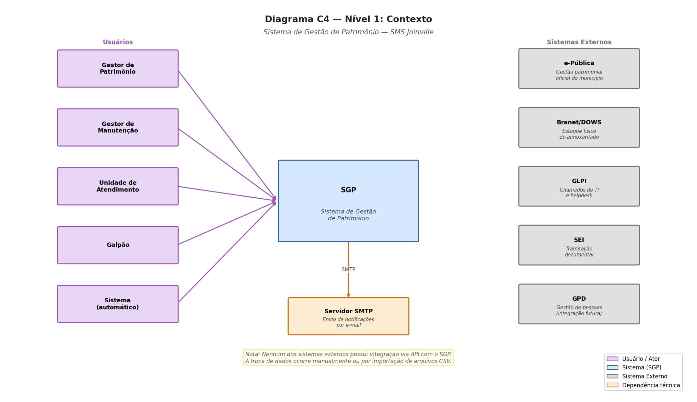
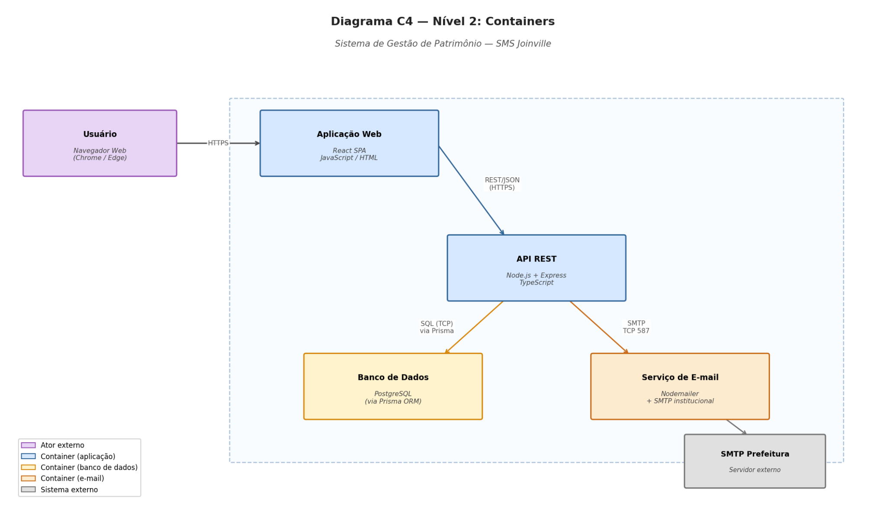
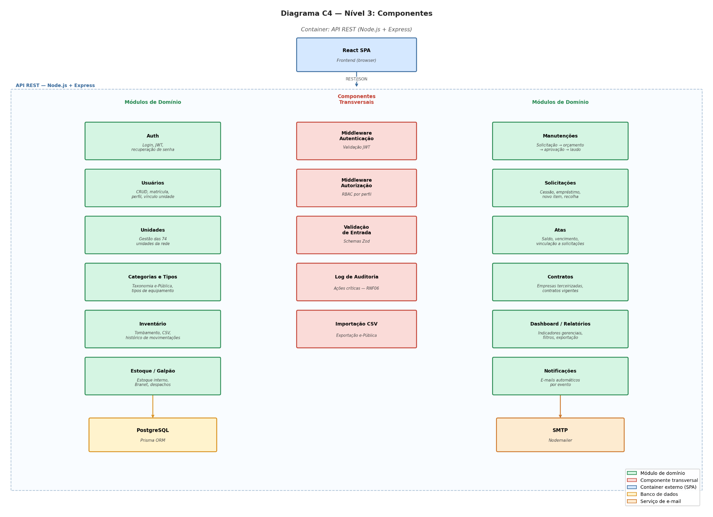

# Arquitetura

Extraído da seção 5 do [RFC v1.0](https://github.com/victor-moy/gestao-patrimonio/blob/main/documentation/RFC.pdf), que também traz o Diagrama Entidade-Relacionamento (Figura 16) completo.

## Diagrama C4 — Nível 1: Contexto

Quem usa o sistema e com quais sistemas externos ele se relaciona (sem integração via API com nenhum deles — troca de dados é manual ou via CSV).

## Diagrama C4 — Nível 2: Containers

## Diagrama C4 — Nível 3: Componentes

## Stack Tecnológica

| Tecnologia | Função | Justificativa |
|---|---|---|
| React | Frontend (SPA) | Arquitetura de componentes reutilizáveis, mapeada diretamente para os módulos do sistema. |
| Node.js + Express | API REST (backend) | Unifica JavaScript em toda a stack; organização da API por módulos de domínio sem overhead de configuração. |
| PostgreSQL | Banco de dados relacional | Domínio altamente relacional (equipamentos, unidades, atas, contratos, histórico); transações ACID e agregações complexas para os relatórios. |
| Prisma ORM | Acesso a dados | Gera tipos TypeScript a partir do schema, migrações declarativas, elimina SQL manual e risco de injeção. |
| JWT + bcrypt | Autenticação e segurança de credenciais | Autenticação stateless (sem sessão no servidor); bcrypt é o hash recomendado pela literatura para senhas web. |
| Nodemailer | Notificações por e-mail | Integração direta com o SMTP institucional da prefeitura, sem depender de SaaS externo. |
| Docker + Docker Compose | Containerização e orquestração | Empacota API, frontend e banco em containers isolados; facilita a implantação na VM da Secretaria. |

## Principais Componentes

O sistema é estruturado em cinco camadas funcionais:

- **API REST** — núcleo da aplicação (Node.js + Express). Cada requisição passa pelo middleware de autenticação JWT, depois pelo middleware de autorização RBAC e pelo validador de schema antes de chegar ao controller. É o único componente com acesso direto ao banco.
- **Sistema de Autenticação** — credenciais próprias (e-mail institucional + senha), hash bcrypt, sessão via JWT com duração fixa (`JWT_EXPIRES_IN`, 30 min por padrão), limite de tentativas de login por conta/IP e segredo obrigatório e forte em produção.
- **Módulo de Processamento de Fluxos** — serviços de domínio que implementam as transições de estado dos processos mais complexos: o ciclo de manutenção (sete etapas de status) e o ciclo de solicitações (cinco tipos — Substituição, Ampliação, Cessão de Uso, Empréstimo e Recolha —, cada um com seu fluxo de aprovação). Aplicam as regras de negócio da seção 2.5 do RFC — ex.: impedir cessão de equipamento em manutenção (RN02), controlar saldo de atas (RN09), disparar solicitação de novo item após laudo de baixa (RN07).
- **Camada de Persistência** — Prisma sobre PostgreSQL; operações multi-tabela em transações atômicas (RN08, RN09); débitos de estoque e de saldo de ata são condicionais no banco para não ficarem negativos sob concorrência.
- **Serviço de Notificações** — acionado após eventos que exigem comunicação às unidades (aprovações/negações, retorno de empréstimo próximo do vencimento, alertas de ata); envio via Nodemailer ao e-mail base da unidade.

## Modelo de Dados (resumo)

- **usuario** — servidores com acesso ao sistema: nome, e-mail institucional, matrícula, perfil (`GESTOR_PATRIMONIO` / `GESTOR_MANUTENCAO` / `UNIDADE` / `GALPAO`), unidade de atuação, flag de ativação.
- **unidade** — unidades da rede (UBS, UME, CAC ou GALPAO), endereço, e-mail base, responsável.
- **categoria** / **tipo_equipamento** — agrupamento de equipamentos espelhando a estrutura do e-Pública.
- **equipamento** — entidade central: tombamento único e imutável (RN01), descrição, tipo, unidade de localização atual, estado de conservação, status operacional e flag de emenda parlamentar (RN10).
- **movimentacao** — log imutável de todo evento que altera localização ou status de um equipamento (nenhum registro é excluído).
- **solicitacao** — centraliza os quatro tipos de demanda operacional (novo item, cessão de uso, empréstimo, recolha), cada um com seu ciclo de status.
- **manutencao** — ciclo completo de uma ordem de manutenção: solicitação, aprovação, orçamento, validação, execução, confirmação dupla de retorno (RN11).
- **contrato** — empresas terceirizadas de manutenção e seus contratos vigentes.
- **ata** — atas de registro de preços, saldo decrementado automaticamente a cada aprovação (RF32), alertas de vencimento/saldo crítico (RF33).
- **log_auditoria** — todas as ações críticas, com snapshot do estado anterior e posterior em JSON (RNF06).

Veja o Diagrama Entidade-Relacionamento completo (Figura 16) na seção 5.2 do [RFC v1.0](https://github.com/victor-moy/gestao-patrimonio/blob/main/documentation/RFC.pdf).
